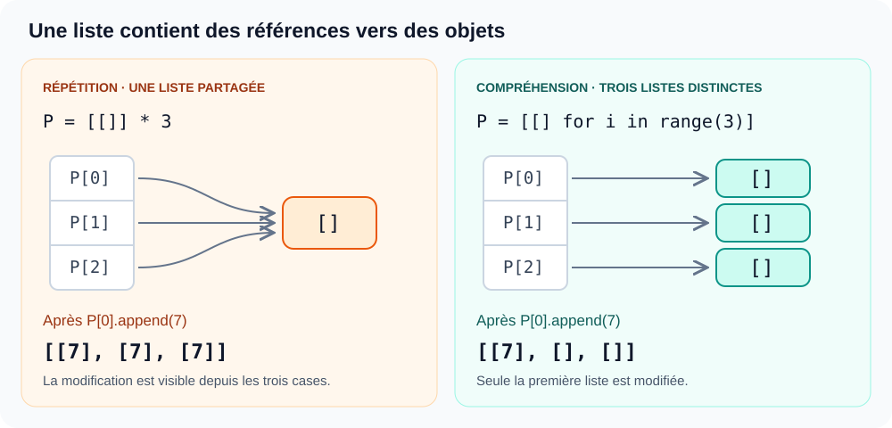
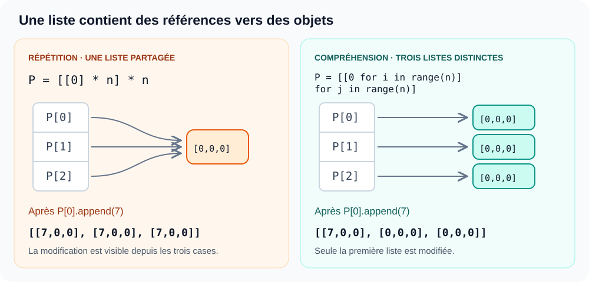

# Mutables et immuables en Python

**Algorithmique · Cours du 09 septembre**  
[Ouvrir les exercices Python](exercice.ipynb)

> **L’idée essentielle**  
> Une liste contient des références vers des objets. Plusieurs cases peuvent donc pointer vers **le même objet**.

**Sommaire** · [Les types](#1-les-types) · [Le schéma du cours](#2-le-schéma-du-cours) · [Les listes partagées](#3-les-listes-partagées) · [Les matrices](#4-application-aux-matrices)

---

## 1. Les types

Un objet **mutable** peut être modifié sur place. Un objet **immuable** (non mutable) ne peut pas être modifié après sa création.

| Type | Exemples | Mutable ? |
| --- | --- | --- |
| Entier (`int`) | `0`, `42` | Non |
| Flottant (`float`) | `3.14` | Non |
| Chaîne (`str`) | `"bonjour"` | Non |
| Tuple (`tuple`) | `(1, 2)` | Non |
| Liste (`list`) | `[1, 2]` | Oui |
| Dictionnaire (`dict`) | `{"a": 1}` | Oui |
| Ensemble (`set`) | `{1, 2}` | Oui |

Un tuple ne permet pas de remplacer ses éléments, mais un objet mutable qu’il contient peut être modifié.

---

## 2. Le schéma du cours

Une liste contient des **références vers des objets**. Voici le schéma du cours repris pour `n = 3`.

### Répétition : `P = [0] * n`

La répétition copie les références contenues dans la liste initiale :

```text
P ──► liste
      ┌──────────┐
      │ indice 0 ├─────┐
      ├──────────┤     │
      │ indice 1 ├─────┼────► entier 0 (immuable)
      ├──────────┤     │
      │ indice 2 ├─────┘
      └──────────┘
```

### Compréhension : `P = [0 for i in range(n)]`

La compréhension évalue l’expression `0` à chaque itération. Elle produit elle aussi une liste de zéros.

> **Précision sur le dessin du tableau :** cela ne garantit pas trois objets entiers distincts. Python peut réutiliser le même objet `0`. Les cercles séparés du dessin ne doivent donc pas être interprétés comme des objets obligatoirement différents.

Dans les deux cas, remplacer un élément de `P` ne modifie pas l’entier `0` : cela change seulement la référence à cet indice.

```python
P = [0] * 3
P[0] = 7
print(P)  # [7, 0, 0]
```

---

## 3. Les listes partagées



*Les flèches représentent les références. Chaque boîte à droite représente une liste intérieure.*

### Répétition : `P = [[]] * 3`

Une seule liste intérieure est créée. Les trois cases pointent vers elle :

```text
P[0] ──┐
P[1] ──┼────► une même liste []
P[2] ──┘
```

```python
P = [[]] * 3
P[0].append(7)
print(P)  # [[7], [7], [7]]
```

`append` modifie la liste intérieure sur place. La modification est donc visible depuis les trois cases.

### Compréhension : `P = [[] for i in range(3)]`

L’expression `[]` crée une nouvelle liste à chaque itération :

```text
P[0] ──────► liste A : []
P[1] ──────► liste B : []
P[2] ──────► liste C : []
```

```python
P = [[] for i in range(3)]
P[0].append(7)
print(P)  # [[7], [], []]
```

---

## 4. Application aux matrices

### Schéma du tableau : deux constructions à comparer



**À gauche :** `P = [[0] * n] * n`. La liste `[0] * n` est créée une seule fois, puis la répétition extérieure copie sa référence.

```python
n = 3
P = [[0] * n] * n
P[0][0] = 7
print(P)
# [[7, 0, 0], [7, 0, 0], [7, 0, 0]]
```

**À droite :** une compréhension imbriquée crée une nouvelle ligne à chaque itération de `j`.

```python
n = 3
P = [[0 for i in range(n)] for j in range(n)]
P[0][0] = 7
print(P)
# [[7, 0, 0], [0, 0, 0], [0, 0, 0]]
```

> **Ce sont les listes représentant les lignes qui doivent être indépendantes.** Les entiers `0`, immuables, peuvent être partagés sans poser ce problème.

### Écriture plus courte et matrice rectangulaire

Pour créer des lignes indépendantes :

```python
matrice = [[0] * 3 for i in range(2)]
matrice[0][0] = 7
print(matrice)  # [[7, 0, 0], [0, 0, 0]]
```

Avec `[[0] * 3] * 2`, les deux lignes référencent la même liste : modifier une case d’une ligne affecte aussi l’autre.

## Fiche mémo

| Construction | Ce qui est créé | Conséquence |
| --- | --- | --- |
| `[0] * 3` | Une liste de trois références vers `0` | Remplacer une case laisse les autres inchangées. |
| `[[]] * 3` | Trois références vers une même liste intérieure | Modifier cette liste est visible depuis les trois cases. |
| `[[] for i in range(3)]` | Trois listes intérieures indépendantes | Modifier une liste laisse les autres inchangées. |

> **À retenir**  
> `*` répète des références. Une compréhension crée des objets distincts lorsque son expression crée un nouvel objet à chaque itération, comme `[]`.

---

## 5. Exercice 1, question 6 — Reconnaître des anagrammes

Deux chaînes sont des **anagrammes** si elles contiennent les mêmes caractères, avec **le même nombre d’occurrences**, quel que soit leur ordre.

Exemples : `"cergy"` et `"ygrec"` sont des anagrammes ; `"aab"` et `"abb"` ne le sont pas.

Les trois méthodes ci-dessous reprennent les idées du tableau. Le code de la méthode par dictionnaires complète l’idée de comptage indiquée par le professeur.

**Convention :** on compare les caractères tels quels : majuscules, accents et espaces comptent. Si les longueurs diffèrent, la réponse est immédiatement `False`. Pour les complexités ci-dessous, **n est la longueur commune des deux chaînes**.

### Méthode 1 — Retirer une occurrence à chaque étape

Pour chaque caractère de `a`, on le cherche dans `b`. S’il est présent, on en retire **une seule occurrence** ; sinon, les chaînes ne sont pas des anagrammes.

```python
def anagramme_retrait(a, b):
    if len(a) != len(b):
        return False

    for c in a:
        if c in b:
            b = b.replace(c, "", 1)
        else:
            return False

    return len(b) == 0
```

Le `1` dans `replace(c, "", 1)` est essentiel : il évite de supprimer toutes les occurrences de `c` d’un seul coup. La chaîne fournie par l’appelant reste inchangée : `b` est réaffectée à une nouvelle chaîne.

**Complexité : O(n²) au pire.** La recherche `c in b` et la construction de la chaîne par `replace` peuvent chacune coûter O(n), et la boucle effectue jusqu’à n tours. Ces coûts s’ajoutent à chaque tour : O(n) + O(n) = O(n).

### Méthode 2 — Trier les caractères puis comparer

Si les chaînes contiennent les mêmes caractères avec les mêmes effectifs, elles deviennent identiques une fois leurs caractères triés.

```python
def anagramme_tri(a, b):
    if len(a) != len(b):
        return False

    a = list(a)
    b = list(b)
    a.sort()
    b.sort()
    return a == b
```

| Étape | Coût |
| --- | --- |
| Transformer les chaînes en listes | O(n) |
| Trier les deux listes | O(n log n) au pire |
| Comparer les listes | O(n) au pire |

**Complexité totale : O(n log n) au pire.** Le tri domine les autres étapes.

### Méthode 3 — Compter avec des dictionnaires

On construit pour chaque chaîne un dictionnaire associant un caractère à son nombre d’occurrences, puis on compare les dictionnaires.

Par exemple, `"aab"` donne `{"a": 2, "b": 1}`. L’ordre d’insertion des clés ne change pas le résultat de la comparaison.

```python
def anagramme_comptage(a, b):
    if len(a) != len(b):
        return False

    d1 = {}
    d2 = {}

    for c in a:
        d1[c] = d1.get(c, 0) + 1

    for c in b:
        d2[c] = d2.get(c, 0) + 1

    return d1 == d2
```

`d1.get(c, 0)` renvoie le compteur actuel de `c`, ou `0` si le caractère n’a pas encore été rencontré.

**Complexité : O(n) en moyenne**, en supposant les opérations de dictionnaire en O(1) en moyenne. On effectue deux parcours de n caractères, puis une comparaison portant sur au plus n clés. La mémoire des compteurs est O(k), où k est le nombre de caractères distincts dans les deux chaînes.

### Comparaison des trois méthodes

| Méthode | Principe | Complexité en temps |
| --- | --- | --- |
| Retrait | Chercher et supprimer une occurrence | O(n²) au pire |
| Tri | Mettre les caractères dans le même ordre | O(n log n) au pire |
| Dictionnaires | Comparer les nombres d’occurrences | O(n) en moyenne |

> **À retenir :** vérifier uniquement que chaque lettre est présente ne suffit pas. Il faut aussi vérifier combien de fois elle apparaît.
